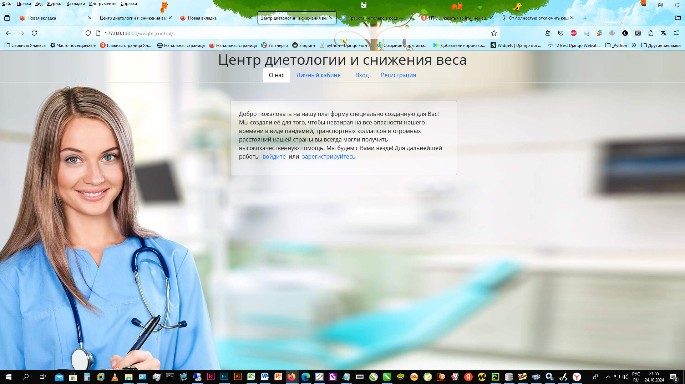
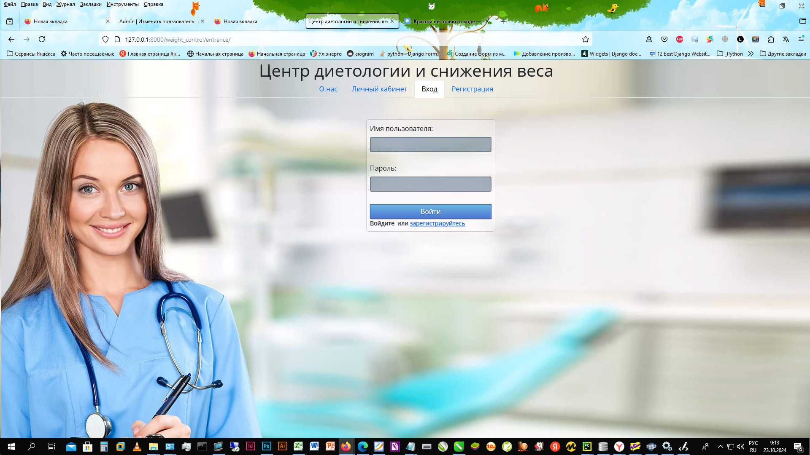
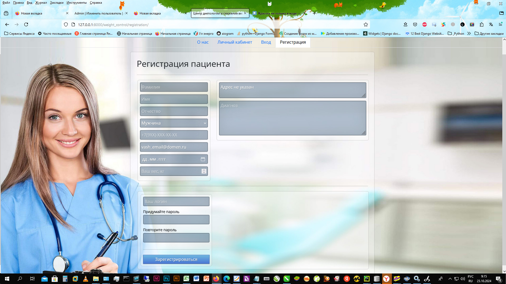
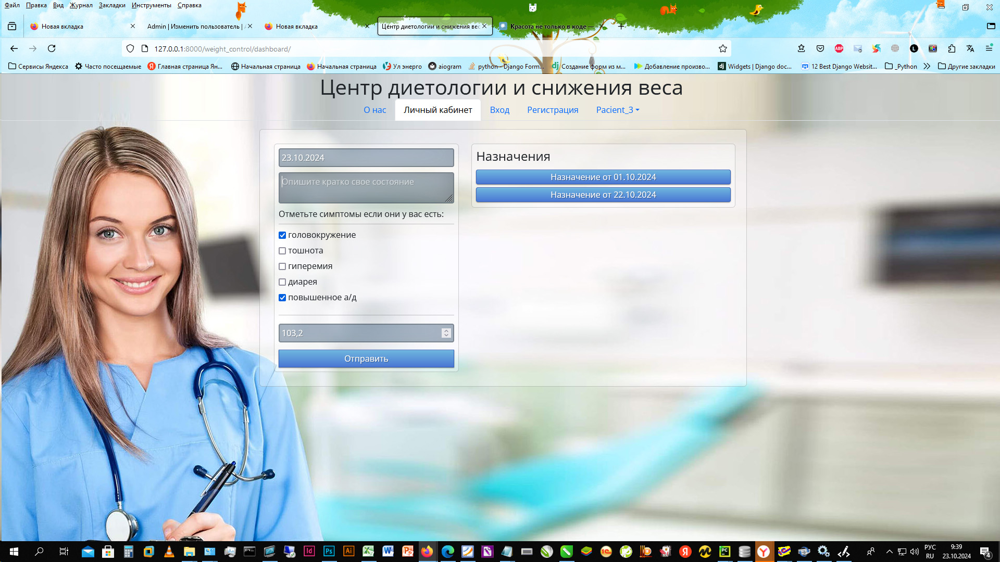
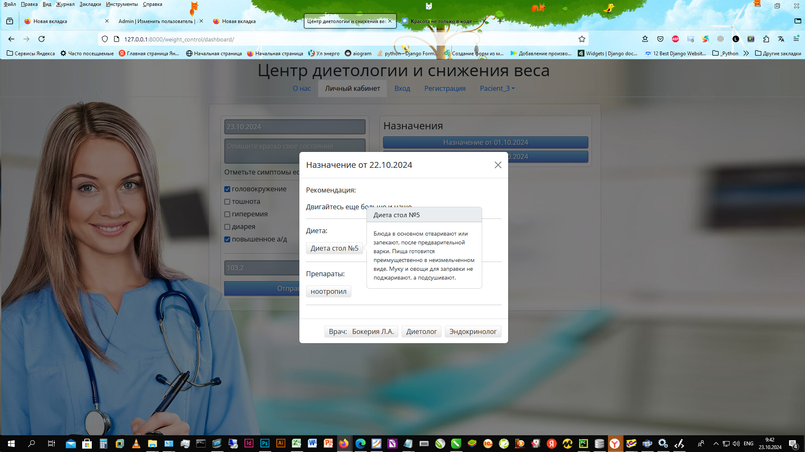
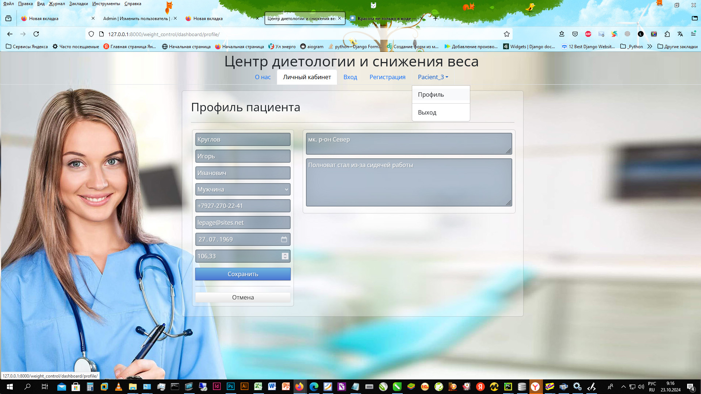
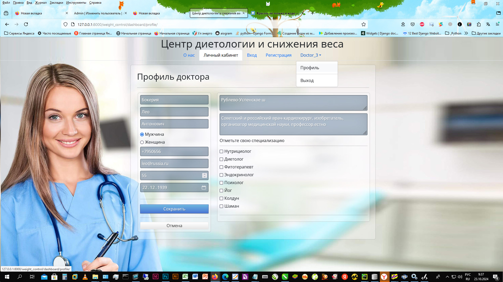
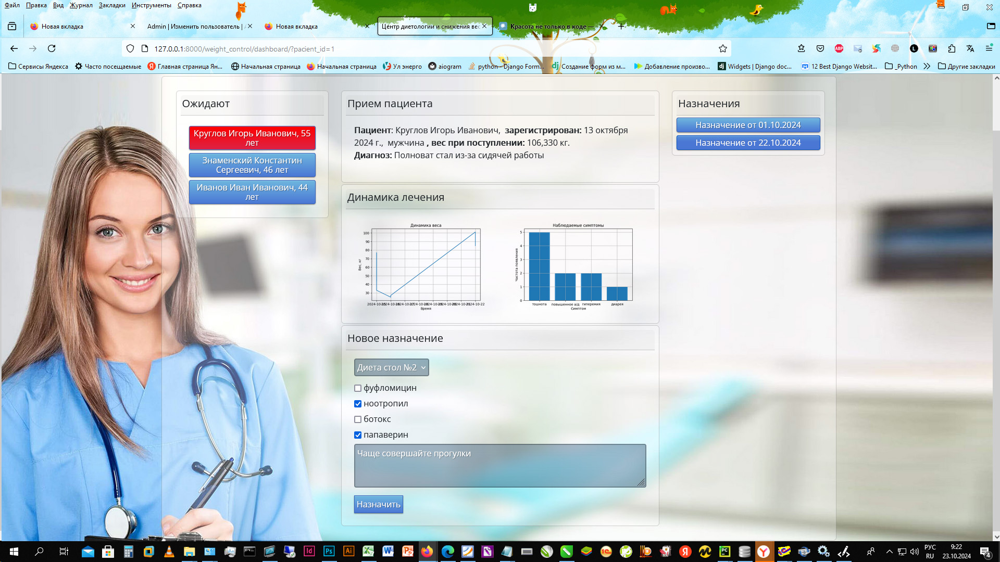
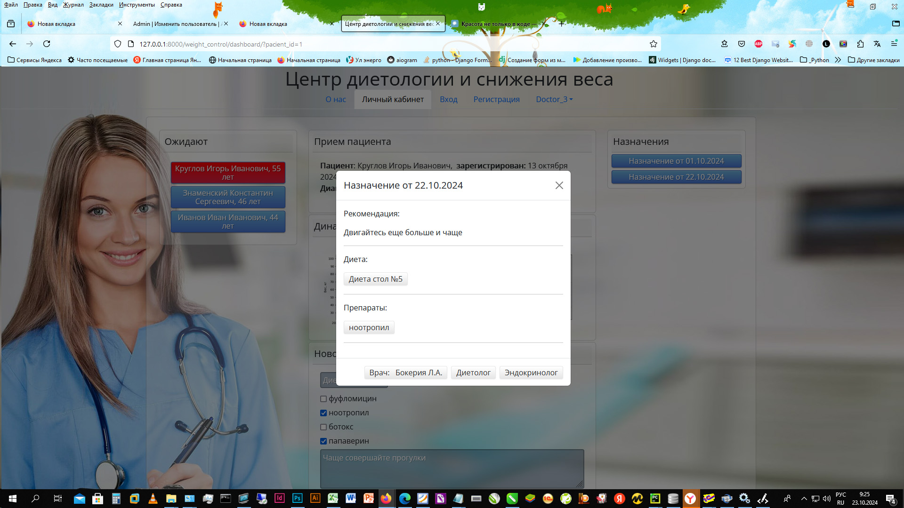
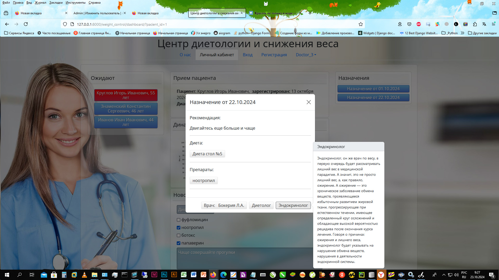



# «Реализация веб-платформы для оказания дистанционных медицинских услуг в области диетологии»

### Автор: Круглов Игорь aka LePage

2024 г.

---

# Веб-приложение на Django

### Техническое задание:

По заказу некоего абстрактного «Центра диетологии и контроля веса», далее «МедЦентр» создаем веб-платформу для удаленного оказания медицинских услуг для пациентов страдающих избыточным весом, дистрофией, анорексией и т.д. Т.З. от заказчика имеет следующий вид:

* С площадкой все работают только удаленно.

* Пользователи могут быть только в одной из трех ипостасей:

  + Группа «Врачи» - доктора

  + Группа «Администраторы» - суперпользователи

  + «Вне групп» - пациенты

* Администратор имеет полный доступ в админпанель

* Администратор через админпанель создает и редактирует справочник медицинских препаратов, справочник диет, справочник возможных побочных симптомов.

* Администратор через админпанель прикрепляет к вновь зарегистрированному пациенту лечащего врача.

* Администратор в админпанели сам создает логины и пароли пользователей-врачей и включает их в группу «Врачи»

* Пользователь зашедший на сайт попадает на начальную страницу «О нас», где знакомится с услугами «МедЦентра», там же ему предлагают войти или зарегистрироваться.

* На странице «Вход» пользователю предлагается ввести логин и пароль, если пользователь не регистрировался в системе ранее ему предлагается зарегистрироваться и перенаправляют на страницу регистрации. Если пользователь ввел правильную пару логин/пароль он входит в систему и авторизуется как врач или пациент в зависимости от принадлежности к группе «Врачи».

* После входа и авторизации пользователь направляется в свой личный кабинет – страница «Личный кабинет».

* При регистрации пользователь задает свою пару логин/пароль и создает свой профиль (Регистрационную карточку) . Которую впоследствии он может редактировать на странице «Профиль».

* Доктор. как уже зарегистрированный Администраторм пользователь создает и редактирует свой профиль в меню «Профиль». Доктор не создавший профиль не может быть прикреплен к пациентам.

* В «Личном кабинете» пациента пользователь может ознакомиться с назначениями от врача, посмотреть подробности о назначенных препаратах, диете, узнать частичную информацию о лечащем враче, его стаже, специальностях. А также отправить отчет (предполагается ежедневный) о своем состоянии, включающий: текущий вес, наблюдаемые возможные симптомы побочных эффектов, а также оставить любую другую информацию на свое усмотрение.

* В «Личном кабинете доктора» врач видит список очереди прикрепленных пациентов, выбирает любого из них, видит краткую информацию из его профиля, видит графики изменения веса пациента и частоты проявления различных побочных симптомов созданные на основе (ежедневных) отчетов пациента. Так же он может ознакомиться с назначениями пациенту выданными ранее и создать новое назначение, если требуется.

### Проект:

На основании Т.З. во фреймворке Django были созданы соответствующие структуре БД (Приложение №1) модели, они были мигрированы во встроенную СУБД SQLite в корне проекта. Была создана структура папок проекта в соответствии с требованиями фреймворка Django . Настроены маршруты. Также в Django были созданы формы для моделей с применением различных виджетов. В представлении, реализованном как в функциональном виде (FBV), так и основанном на Class-based View (CBV), была создана логика проекта, описывающая алгоритм Т.З. Для создания графических изображений, иллюстрирующих динамику процесса лечения, использовалась библиотека matplotlib.pyplot.

При обращении по HTTP адресу проекта пользователь попадает на страницу «О нас»

Рис. 1. Страница «О нас»

При нажатии на ссылку «войти» либо выбрав пункт меню «Вход» пользователь перенаправляется на страницу аутентификации.

Рис. 2. Страница «Вход»

Где он сможет войти в систему как авторизованный пользователь или перейти на страницу «Регистрация» по ссылке или пункту меню «Регистрация». Пользователи - врачи портала в системе уже зарегистрированы Администратором.

Рис. 3. Страница «Регистрация»

После регистрации либо входа, либо по кнопке меню «Личный кабинет» пользователь перенаправляется на страницу «Личного кабинета» вид которой зависит от «ипостаси» (так в Т.З.) пользователя - врач или пациент.

В «Личном кабинете» пациента пользователь может отправить врачу отчет о своем текущем состоянии:

Рис. 4. Страница «Личного кабинета» пациента. Основной вид.

Либо ознакомиться с текущим или прошлыми назначениями.

Рис. 5. Страница «Личного кабинета» пациента. Дополнительный вид.

При желании авторизованный пользователь может отредактировать, а пользователь-врач ещё и создать свой профиль выбрав пункт меню «Профиль»

Рис. 6. Страница редактирования профиля пациента.

Рис. 7. Страница редактирования профиля врача.

Также пользователь, авторизованный как врач, после входа или выбрав пункт меню «Личный кабинет» попадает на страницу личного кабинета врача. Где выбрав пациента из списка ожидающих приема, может ознакомиться с карточкой пациента, динамикой лечения, создать новое назначение, ознакомиться с предыдущими назначениями.

Рис. 8. Личный кабинет врача.

Рис. 9. Личный кабинет врача. Предыдущие назначения.

Рис. 10. Личный кабинет врача. Предыдущие назначения. Расширенный вид.

Так же по пункту меню «Профиль» авторизованный пользователь-врач может создать/отредактировать свой профиль.

Рис. 11. Профиль доктора.

# ПРИЛОЖЕНИЕ №1. Структура БД

Для хранения данных о пациентах, врачах, назначений, отчетов и различных справочников и связей между ними, была разработана следующая структура **Базы** **Данных** (**БД**)

| 1   | **auth_user** | **пользователи (встроенная таблица Django)** |
| --- | --- | --- |

| 2   | **Pacient_Profile** | **профиль пациента** |
| --- | --- | --- |
| &nbsp; | Id  | &nbsp; |
| &nbsp; | User | _1 -2- 1 к auth_user_ |
| &nbsp; | Family | &nbsp; |
| &nbsp; | first_name | &nbsp; |
| &nbsp; | second_name | &nbsp; |
| &nbsp; | phone_number | &nbsp; |
| &nbsp; | Adress | &nbsp; |
| &nbsp; | birth_date | &nbsp; |
| &nbsp; | first_diagnos | &nbsp; |
| &nbsp; | start_weight | &nbsp; |
| &nbsp; | Gender | &nbsp; |
| &nbsp; | registration_date | &nbsp; |
| &nbsp; | Email | &nbsp; |
| &nbsp; | Doctor_Profile | _1-2-М к Doctor_Profile_ |

| 3   | **Doctor_Profile** | **профиль врача** |
| --- | --- | --- |
| &nbsp; | Id  | &nbsp; |
| &nbsp; | User | _1-2- 1 к auth_user_ |
| &nbsp; | Family | &nbsp; |
| &nbsp; | first_name | &nbsp; |
| &nbsp; | secondary_name | &nbsp; |
| &nbsp; | doc_stage | &nbsp; |
| &nbsp; | doc_specialty | _M-2-M к Specialty_list_ |
| &nbsp; | birth_date | &nbsp; |
| &nbsp; | Email | &nbsp; |
| &nbsp; | phone_number | &nbsp; |
| &nbsp; | registration_date | &nbsp; |
| &nbsp; | foto_file_path | &nbsp; |
| &nbsp; | Gender | &nbsp; |

| 4   | **Diets_List** | **список диет** |
| --- | --- | --- |
| &nbsp; | id  | &nbsp; |
| &nbsp; | title | &nbsp; |
| &nbsp; | description | &nbsp; |
| &nbsp; | foto_file_path | &nbsp; |

| 5   | **Preparats_List** | **список препаратов** |
| --- | --- | --- |
| &nbsp; | id  | &nbsp; |
| &nbsp; | title | &nbsp; |
| &nbsp; | description | &nbsp; |
| &nbsp; | foto_file_path | &nbsp; |

| 6   | **Assignment** | **назначения пациентам** |
| --- | --- | --- |
| &nbsp; | id  | &nbsp; |
| &nbsp; | assign_date | &nbsp; |
| &nbsp; | pacient_profile | _1-2-M к Pacient_Profile_ |
| &nbsp; | doctor_profile_id | _1-2-M к Doctor_Profile_ |
| &nbsp; | description | &nbsp; |
| &nbsp; | diets | _1-2-M к Diets_List_ |
| &nbsp; | preparats_list | _M-2-M к Preparats_List_ |

| 7   | **Pacient_reports** | **отчет пациента** |
| --- | --- | --- |
| &nbsp; | id  | &nbsp; |
| &nbsp; | report_date | &nbsp; |
| &nbsp; | weight_today | &nbsp; |
| &nbsp; | symptoms_list | _М-2-М к Symptoms_List_ |
| &nbsp; | patient_profile | _1-2-M к Pacient_Profile_ |

| 8   | **Specialty_list** | **специальности врачей** |
| --- | --- | --- |
| &nbsp; | id  | &nbsp; |
| &nbsp; | title | &nbsp; |
| &nbsp; | description | &nbsp; |

| 9   | **Symptoms_list** | **Список симптомов** |
| --- | --- | --- |
| &nbsp; | id  | &nbsp; |
| &nbsp; | title | &nbsp; |
